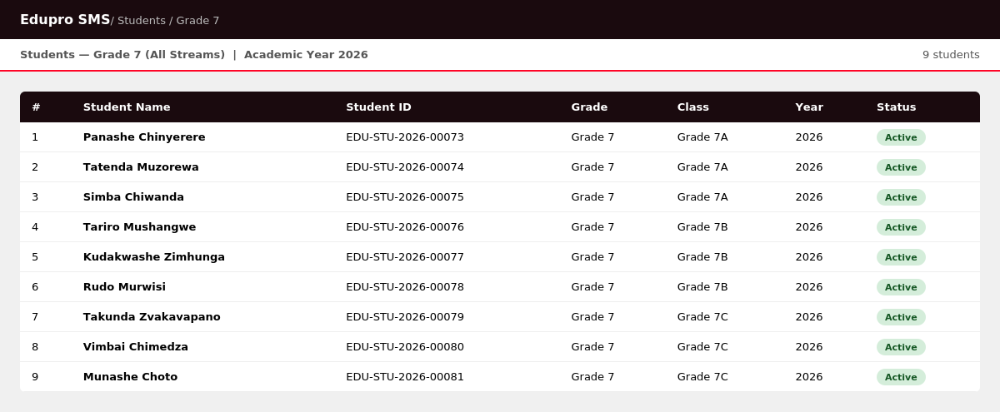
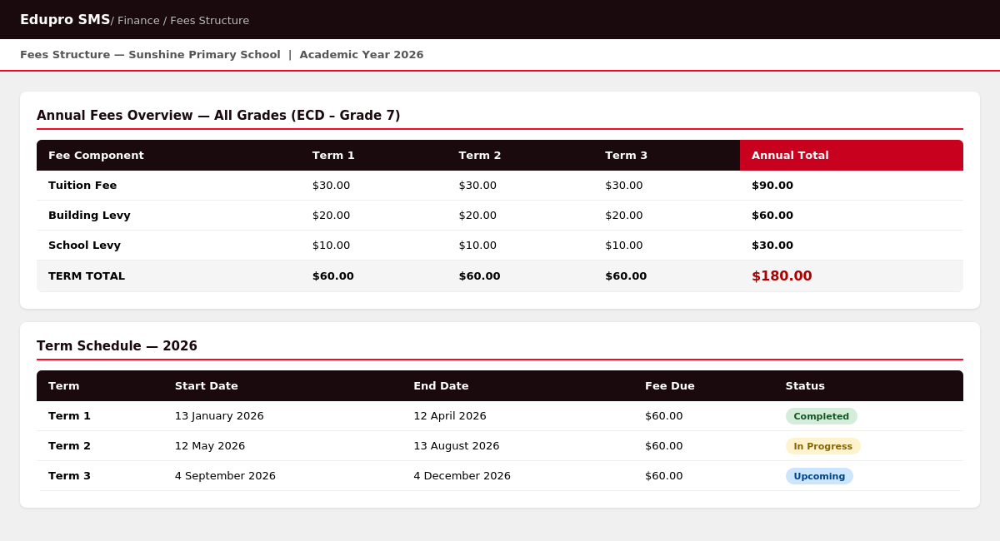
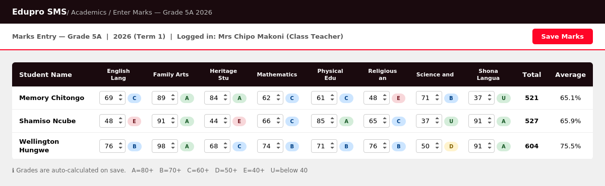
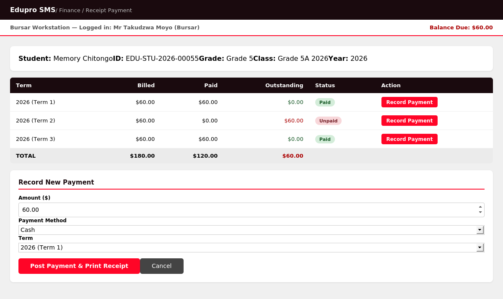

# Edupro SMS – School Management System

Edupro SMS is a complete school management platform built for Zimbabwe primary schools following the **ZIMSEC Heritage Based Curriculum**. It covers student records, academic reporting, and fees management for ECD through Grade 7.

---

## Stack

| Component | Version  |
|-----------|----------|
| Edupro SMS (core) | 15.0.0   |
| Moodle LMS        | 4.x      |
| Python    | 3.11     |
| Node      | 22       |
| MariaDB   | 10.x     |
| Redis     | 7.x      |

---

## Features

- **Students & Classes** — ECD A/B through Grade 7, 3 streams per grade (A/B/C)
- **ZIMSEC Curriculum** — 6 core subjects: English, Shona, Maths, Science & Technology, Heritage Studies, Family Arts & Technology
- **Report Cards** — Zimbabwe Infant/Junior format, auto-graded (A–E for ECD–Grade 6; 1–7 for Grade 7)
- **Fees Management** — Per-term invoicing with Tuition, Building Levy and School Levy breakdown
- **Parent Portal** — Parents view report cards and fees statements online
- **Teacher Marks Entry** — Class teachers enter marks per subject, grades calculated automatically
- **Bursar Payment Receipting** — Record cash/EcoCash/bank payments and print receipts

---

## Screenshots

### Student Records


### Subjects & Grading Scales


### Fees Structure


### Teacher Marks Entry


### Bursar — Payment Receipting


### Parent Portal


> **Live URL:** `http://your-school.edupro.co.zw/parent-portal`
> - Logged-in parents see their child's dashboard automatically
> - Demo/guest visitors see a class + student selector to preview any student

---

## Sample Documents

| Document | Description |
|----------|-------------|
| [report_card_grade7a.pdf](sample-docs/report_card_grade7a.pdf) | Grade 7A report cards (3 students) — Zimbabwe Junior format |
| [fees_statement_tatenda.pdf](sample-docs/fees_statement_tatenda.pdf) | Annual fees statement with 3-term breakdown |

---

## How It Works

### For Teachers — Entering Student Marks

1. Log in at `http://your-school.edupro.co.zw/login`
2. Go to **Academics → Assessment → Assessment Plan**
3. Select the class (e.g. Grade 5A 2026) and the term
4. Click the class group to open the marks sheet
5. Enter each student's score out of 100 for each subject
6. Click **Save** — grades are auto-calculated:

   | Mark Range | Grade (ECD–Gr 6) | Grade (Gr 7) |
   |-----------|-----------------|--------------|
   | 80 – 100% | A – Excellent   | 1 – Distinction |
   | 70 – 79%  | B – Very Good   | 2 – Merit    |
   | 60 – 69%  | C – Good        | 3 – Credit   |
   | 50 – 59%  | D – Satisfactory | 4 – Pass    |
   | 40 – 49%  | E – Needs Improvement | 5 – Pass |
   | 25 – 34%  | —               | 6 – Needs Improvement |
   | 0 – 24%   | U               | 7 – Below Expectations |

7. Once all marks are saved, go to **Report Card** → select class → click **Generate Report Cards**
8. Click **Print** to print all cards for the class at once

---

### For the Bursar — Receipting Fee Payments

1. Log in and go to **Finance → Fees Statement**
2. Select the student's class, then select the student by name
3. Click **Generate Statement** — the system shows each term's billed / paid / outstanding amounts
4. To record a payment:
   - Enter the **amount received**
   - Select the **payment method** (Cash / EcoCash / Bank Transfer)
   - Select the **term** the payment is for
   - Click **Post Payment & Print Receipt**
5. The student's outstanding balance updates immediately
6. A printable receipt is generated automatically

> The full school fees structure is:
> - **Tuition Fee:** $30.00 per term
> - **Building Levy:** $20.00 per term
> - **School Levy:** $10.00 per term
> - **Total:** $60.00 per term / $180.00 per year

---

### For Parents — Viewing Reports & Statements Online

Parents access their child's records through the **Parent Portal** — no installation required, just a web browser.

**URL:** `http://your-school.edupro.co.zw`

1. Visit the school's Edupro SMS web address
2. Click **Parent Login** and enter the login credentials provided by the school
3. The dashboard shows the child's name, class, and fee balance at a glance
4. Click **Report Card** to view or download the term report card as PDF
5. Click **Fees Statement** to view all three terms' billing and payment history
6. Parents can print statements directly from the browser

> **Direct links (staff can share with parents):**
> - Report Cards: `http://your-school.edupro.co.zw/report-card`
> - Fees Statement: `http://your-school.edupro.co.zw/fees-statement`

---

## Installation Guides

### Windows (Local Machine)
> Uses WSL 2 (Windows Subsystem for Linux) — no dual boot required.

→ [docs/install-windows.md](docs/install-windows.md)

### VPS / Linux Server
> Ubuntu 22.04 or 24.04 LTS. Includes Nginx, SSL, and production setup.

→ [docs/install-vps-linux.md](docs/install-vps-linux.md)

---

## Quick Start (Linux / WSL)

```bash
# Run as root on a fresh Ubuntu server
bash setup/install.sh
```

## Load Demo Data (Sunshine Primary School)

```bash
# Step 1 — seed students, classes, subjects, academic year
bench --site your-site.local execute frappe.sunshine_seed.seed_all

# Step 2 — seed assessment results (direct SQL)
python3 seeds/seed_assessments.py

# Step 3 — seed fee records
python3 seeds/seed_fees.py
```

## Start the Web Server

```bash
bash setup/start.sh
```

Then visit: `http://edupro.local:8000/login`
- **Username:** `Administrator`
- **Password:** `edupro2025`

---

## Directory Structure

```
/home/frappe/edupro-sms/     ← symlink (no spaces — use for all commands)
/home/frappe/Edupro SMS/     ← real bench directory
```

> Always run bench commands via the symlink path to avoid shell issues.

---

## Repository Files

```
setup/
  install.sh              Full automated installation script
  start.sh                Start gunicorn + redis
  stop.sh                 Stop all services
config/
  common_site_config.json   Bench site config
  mariadb-99-frappe.cnf     MariaDB UTF-8 settings
  redis_cache.conf          Redis cache (port 13000)
  redis_queue.conf          Redis queue (port 11000)
patches/
  frappe-esbuild-utils.patch   Fix for symlink path resolution in esbuild
seeds/
  sunshine_seed.py          Main school data seed script
  seed_assessments.py       Assessment plans and results (direct SQL)
  seed_fees.py              Fee invoices with randomised payment statuses
custom/
  report_card_api.py        Backend API for report card data
  report-card.html          Report card web page (standalone)
  fees_statement_api.py     Backend API for fees statement data
  fees-statement.html       Fees statement web page (standalone)
sample-docs/
  report_card_grade7a.pdf   Sample report card — Grade 7A (3 students)
  fees_statement_tatenda.pdf  Sample fees statement — Tatenda Muzorewa
docs/
  install-windows.md        Windows installation guide
  install-vps-linux.md      VPS/Linux installation guide
  installation-notes.md     Known issues and notes
  screenshots/              UI screenshots for documentation
```
